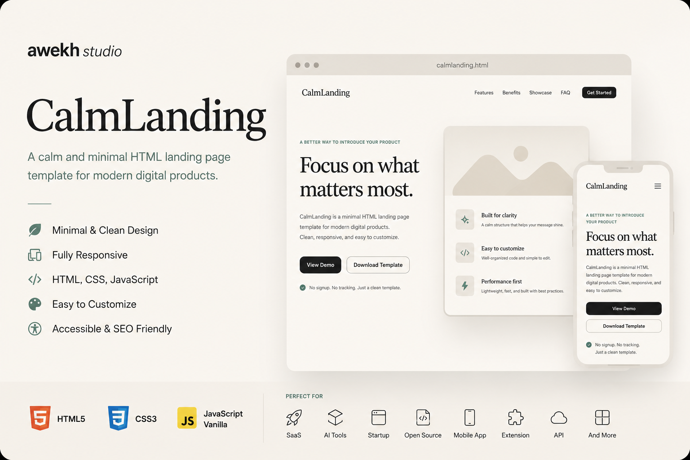
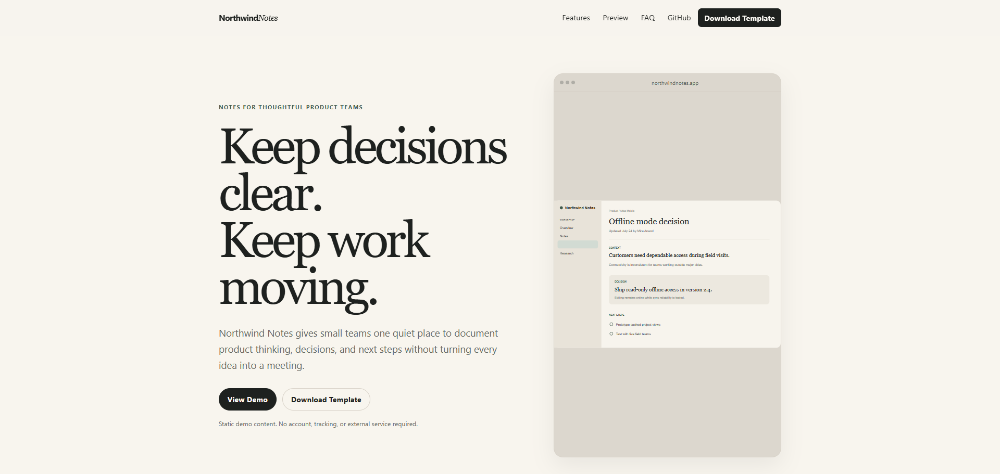
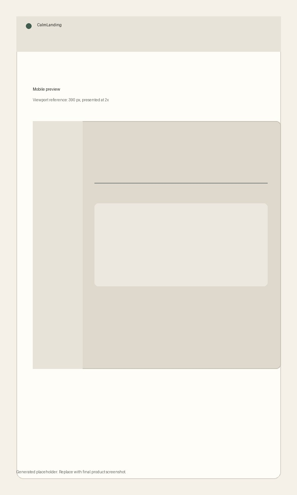

# CalmLanding

> A calm and minimal HTML landing page template for modern digital products.



[Live Demo](https://awekhstudio.github.io/calmlanding/) · [Repository](https://github.com/awekhstudio/calmlanding)

## Overview

CalmLanding is a dependency-free, one-page landing page template for SaaS products, AI tools, startups, indie projects, open-source software, apps, APIs, browser extensions, and template products. It uses semantic HTML, modern CSS, and a small amount of vanilla JavaScript.

The included demo promotes **Northwind Notes**, a fictional product. All product names, people, companies, links, claims, and testimonials are placeholder content and must be replaced before publication.

## Features

- Semantic single-page structure
- Mobile-first responsive layout
- Accessible mobile navigation
- Keyboard-friendly FAQ accordion
- Accessible responsive preview tabs
- Active section navigation
- Reduced-motion aware smooth scrolling
- Local preview and favicon assets
- CSS variables and consistent spacing tokens
- Print-safe fallback styles
- No framework, dependency, external font, or build process
- GitHub Pages workflow and repository documentation

## Calm Principles

### Content First
The hierarchy begins with useful product information, not visual decoration.

### Quiet by Default
Color, motion, borders, and interface elements are deliberately restrained.

### Built to Last
The template uses stable web standards and avoids dependency churn.

### Accessible to Everyone
Semantic markup, keyboard support, visible focus, and readable contrast are part of the foundation.

## Preview





The repository preview images above are the current release screenshots. Recommended capture sizes and update guidance are documented in [`preview/README.md`](preview/README.md).

## Getting Started

### Download

Download the ZIP, extract it, and open `index.html` in a modern browser.

### Clone

```bash
git clone https://github.com/awekhstudio/calmlanding.git
cd calmlanding
```

No install or build command is required.

## Customization

1. Replace all Northwind Notes copy, dummy names, testimonials, URLs, and metadata in `index.html`.
2. Replace `assets/images/product-preview-desktop.svg`, `product-preview-tablet.svg`, and `product-preview-mobile.svg` with compositions made for each viewport. Do not use one cropped image for all three modes.
3. Update each preview image's `width`, `height`, and alternative text in `index.html`. The alt text should describe the product interface, not the decorative browser frame.
4. Change the visible tab labels in `index.html` when needed, while preserving each tab's `id`, `aria-controls`, and matching panel relationship.
5. Edit design tokens in `:root` inside `assets/css/style.css` to change colors, spacing, typefaces, radius, preview framing, and container width.
6. Keep heading order and accessible button attributes intact when changing sections.
7. Update the canonical URL, Open Graph image, GitHub links, version, sitemap, and robots file before publishing.

## Accessibility

CalmLanding includes a skip link, semantic landmarks, logical headings, visible focus states, labeled navigation, an ARIA-aware mobile menu, an accessible FAQ accordion, Escape-key handling, descriptive image text, and reduced-motion support. Test customized content with keyboard-only navigation and automated accessibility tools before release.

## Repository Structure

```text
calmlanding/
├── .github/
│   ├── ISSUE_TEMPLATE/
│   ├── workflows/pages.yml
│   └── pull_request_template.md
├── assets/
│   ├── css/reset.css
│   ├── css/style.css
│   ├── icons/favicon.svg
│   ├── images/product-preview-desktop.svg
│   ├── images/product-preview-tablet.svg
│   ├── images/product-preview-mobile.svg
│   └── js/main.js
├── preview/
│   ├── README.md
│   ├── calmlanding-cover.jpg
│   ├── calmlanding-desktop.jpg
│   └── calmlanding-mobile.jpg
├── 404.html
├── CHANGELOG.md
├── CONTRIBUTING.md
├── LICENSE
├── README.md
├── SECURITY.md
├── index.html
├── robots.txt
└── sitemap.xml
```

## Deployment

The repository can be deployed to GitHub Pages, Netlify, Cloudflare Pages, or ordinary shared hosting. Use the repository root as the publish directory. No build command is needed.

## GitHub Pages

The included workflow publishes the static repository when changes are pushed to `main`. Alternatively, choose **Settings → Pages → Deploy from a branch → main → root**.

The included links and canonical URL target the official CalmLanding repository and GitHub Pages site. Update `sitemap.xml`, `robots.txt`, canonical metadata, and Open Graph metadata only when publishing under a different account or domain.

## License

[MIT](LICENSE)

## Credits

CalmLanding is designed and maintained by [awekh studio](https://github.com/awekhstudio), using the standards and repository foundation of awekh-starter.
